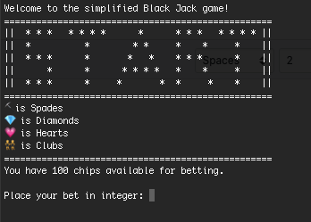
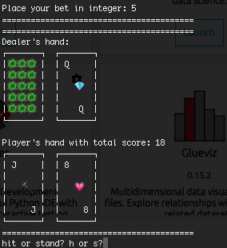
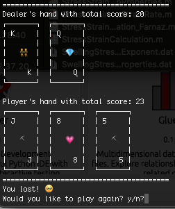
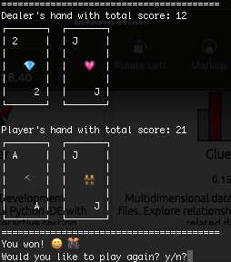
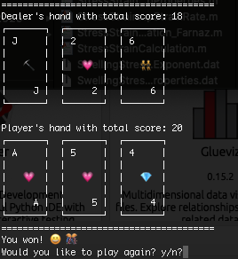
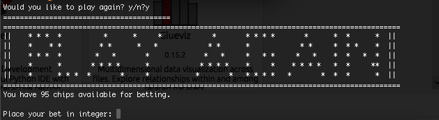
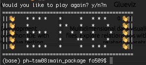
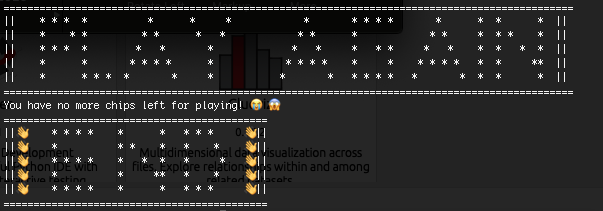
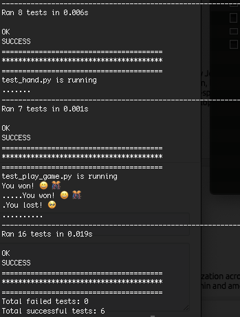

# Simplified BlackJack Game (Python 3)
## Technologies used
- Python 3
- Unittest (TDD)
- Shell script
- pylint
## Rules of the game
- At the start of the game, the player get 100 chips to play with.
- At the start of each round, player can choose the amount they want to bet. 
- At the start of each round, the player and dealer get two cards each.
- While playing, all the player's cards are displayed.
- While playing all of the dealer's cards except for one is displayed.
- The aim of the game is to get your hand's score as close as possible to 21. 
- Scores of the cards from 2-10 are as the numbers displayed on the card.
- Jack, Queen and King each are scored as 10.
- Score of Ace depends on the existing score; if the score of a hand is more than 11, Ace is counted as 1 otherwise it is 11.
- After the first deal of the cards, the player gets an option to hit (get a new card) or stand (happy with the cards they have).
- If the player's score reaches 21 they win the game.
- If the player's score becomes more than 21 they lose.
- If the player's score is less than 21 and less than or equal to dealer's score, they lose as well.
## Playing the game
- Navigate to the `main_package` folder <br/>
```cd {$PATH_TO_REPO_ROOT}/SimplifiedBlackJackGame/python_code/main_package/```
- Make `playBlackJack.sh` executable by typing<br/>
```chmod +x playBlackJack.sh```
- Run `./playBlackJack.sh`<br/>
Once the game starts you will see this <br/>

- Place your bet by entering an integer between 0 and the total number of chips that you have.
- The game starts and the dealer deals card to you and himself. 
- You are then asked if you want to hit (take another card) or stand (continue with your existing hand)<br/>

- If you choose hit, you will get another card. 
  - If the next card takes your score above 21 you lost the round.<br/>
  
  - If the next card takes you to score 21 you win the round.<br/>
  
  - otherwise you are asked for hit or stand again.
- When you choose to stand, now dealer will play his hand.
  - If his score goes over 21 you win.
  - If his score becomes 21 you lose.
  - Otherwise, you will go to the next step where both of your scores are compared.
- If at this point your score is higher than dealer you will win, otherwise you will lose.<br/>

- If you win, your chips increase by the amount that you have bet and if you lose, your chips reduce by the same amount.
- At the end of the round you are asked if you would like to play again.
  - If you choose to play again you start at the betting step.<br/>
  
  - If not, the game ends. <br/>
   <br/>
__Note__ if you don't have enough chips, the game will automatically end.


## Running the unit tests
To run the unit tests:
- Navigate to the `test_package` folder <br/>
```cd {$PATH_TO_REPO_ROOT}/SimplifiedBlackJackGame/python_code/test_package/```
- Make `runTests.sh` executable by typing<br/>
```chmod +x runTests.sh```
- Run `./runTests.sh`<br/>
- This will run the tests for each of classes and displays how many have passed or failed.<br/>


## Linting the files
### main_package
- Navigate to the `main_package` folder <br/>
- Make `runMainLinting.sh` executable by typing<br/>
```chmod +x runMainLinting.sh```
- Run `./runMainLinting.sh`<br/>
### test_package
- Navigate to the `test_package` folder <br/>
- Make `runTestsLinting.sh` executable by typing<br/>
```chmod +x runTestsLinting.sh```
- Run `./runTestsLinting.sh`<br/>
